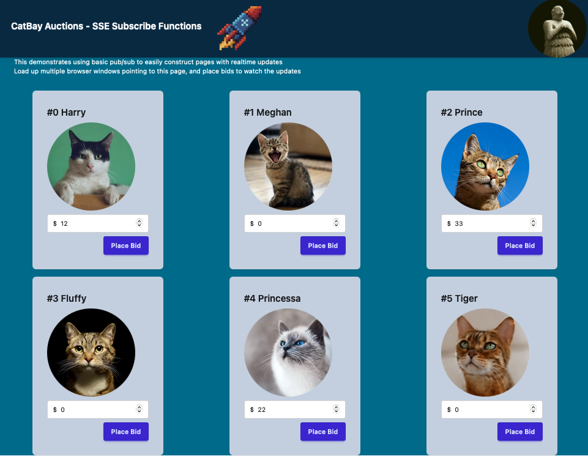
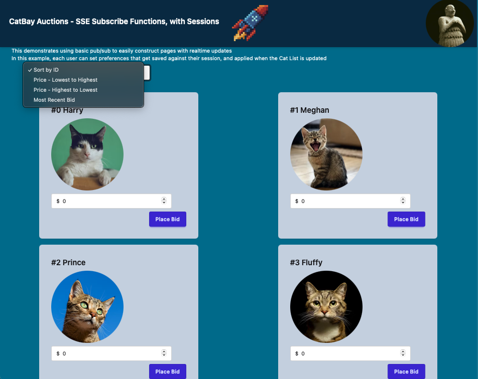
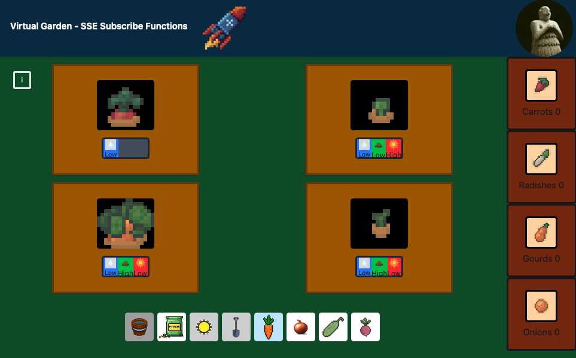

# Datastar lib for http.zig

A Zig library that conforms to the Datastar SDK specification.

https://github.com/starfederation/datastar/blob/develop/sdk/ADR.md

.. and passes the official test cases.

This SDK uses streams all the way down, so there is no implicit extra allocations.

Versions :
- Datastar 1.0.0-RC7
- Zig 0.15.2

It uses the latest "writergate" changes for zig 0.15.2, and makes good use of the high speed buffered 
interfaces. The SDK is very fast, and very lightweight.

Example apps provided with
- http.zig
- tokamak
- (more to follow)

# Future Updates

Future updates to this repo will include support for Zig stdlib http server, as well as 
other popular HTTP server libs, such as zzz, zio, and zap.

Waiting on Zig 0.16 to land before this can be complete.

Will provide example apps that demonstrate using this SDK with each of these frameworks 
as they get ported.

Once this lib is fully generic across multiple frameworks, I will rename it to `datastar.zig` to reflect that.


# Audience and Scope

Who is this repo for ?

- Anyone interested in using Datastar. https://data-star.dev.

It is a state of the art Hypermedia-first library for building apps. 

Its not "yet another frontend framework" - its a 10kb JS shim that allows you to write application code
at the backend, and leverage modern browser standards to have a very fast, very light, reactive UI 
with none of the junk. There are no build steps, no npm deps - just declarative HTML and reactive signals,
driven from the backend.

If you know, you know.

It uses a well defined SSE-first protocol that is backend agnostic - you can use the the same simple 
SDK functions to write the same app in Go, Clojure, C#, PHP, Python, Bun, Ruby, Rust, Lisp, Racket, Java, etc. 

This project adds Zig to that list of supported SDK languages.

It uses the exact same spec as all the other SDK's, and reads extremely similarly to say - a Go program
or a Python program using the same SDK.

Why consider the Zig version then ? Who is that for ?

- Existing Zig programmers who want to try Datastar
- Datastar app builders who want to experiment with performance, and dabble in new backend languages

Consider Zig if every microsecond counts, or you want stupidly small memory footprints that dont grow.

Zig gives you some pretty good tuning options if you want to chase benchmarks and break records too.

We are talking orders of magnitude performance and resource usage gains for your existing Datastar app, depending
on what you are currently using. 

Try it out.

# Quick Start Introduction

If you just want to quickly install this, and try out the demo programs first, do this :

```
... get zig 0.15.2 installed on your machine
git clone https://github.com/zigster64/datastar.http.zig
cd datastar.http.zig
zig build
./zig-out/bin/example_1
```

Then open your browser to http://localhost:8081


This will bring up a kitchen sink app that shows each of the SDK functions in use in the browser, with a 
section that displays the code to use on your backend to drive the page you are looking at.


`./zig-out/bin/tokamak_basic` - Same application, but using Tokamak instead of directly using http.zig

---

To run the additional example apps, try

`./zig-out/bin/example_2` - a simple cat auction site.
Bring up multiple browser windows and watch the bids get updated in realtime to all windows.



---

`./zig-out/bin/example_22` - a more complex cat aution site, with session based preferences managed at the backend.
Bring up multiple browser windows and watch the bids get updated in realtime to all windows.
Change preferences, and watch that all browser windows in the same session get their preferences updated.

Use a different machine, or browser, or use the 'Profiles' feature in Chrome/Safari/Firefox to simulate a new session.
Note that the bids update in realtime across all browsers, and just the preferences changes are sticky across all 
windows belonging to the same machine/profile.



---

`./zig-out/bin/example_5` - an excellent and exciting multi-player farming simulator, where users can plant and attend 
to various crops to help them grow to harvest (or whither and die if neglected)



# Validation Test

When you run `zig build`, it will compile several apps into `./zig-out/bin` including a binary called `validation-test`

Run `./zig-out/bin/validation-test`, which will start a server on port 7331

Then follow the procedure documented at

https://github.com/starfederation/datastar/blob/main/sdk/tests/README.md

To run the official Datastar validation suite against this test harness

The source code for the `validation-test` program is in the file `tests/validation.zig`

Current version passes all tests.

# Contrib Policy

All contribs welcome.

Please raise a github issue first before adding a PR, and reference the issue in the PR title. 

This allows room for open discussion, as well as tracking of issues opened and closed.


# Example Apps

When you run `zig build` it will compile several apps into `./zig-out/bin/` to demonstrate using different parts 
of the api

Using http.zig :

- example_1  shows using the Datastar API using basic SDK handlers
- example_2  shows an example multi-user auction site for cats with realtime updates using pub/sub
- example_22 Same cat auction as above, but with per-user preferences, all handled on the backend only

<!-- - example_3  shows an example multi-user pigeon racing betting site with realtime updates -->
<!-- - example_4  shows an example multi-game, multi-player TicTacToe site, using the backstage actor framework -->

- example_5  shows an example multi-player Gardening Simulator using pub/sub

Using Tokamak with Dependency Injection :

- tokamak_basic  shows using the Datastar API using basic SDK handlers (same as example_1, but with Tokamak)

<!-- Using zig stdlib http server : -->

TODO :

- Zig stdlib examples with Zig 0.16 async/threaded
- Jetzig examples
- Zio/Dusty examples
- zzz examples
- zap examples
- backstage (actor framework) examples


<!-- - example_10 as per example_1, but using zig stdlib instead of http.zig -->


# Installation and Usage

To build an application using this SDK

1) Add datastar.http.zig as a dependency in your `build.zig.zon`:

```bash
zig fetch --save="datastar" "git+https://github.com/zigstser64/datastar.http.zig#master"
```

2) In your `build.zig`, add the `datastar` module as a dependency you your program:

```zig
const datastar = b.dependency("datastar", .{
    .target = target,
    .optimize = optimize,
});

// the executable from your call to b.addExecutable(...)
exe.root_module.addImport("datastar", datastar.module("datastar"));
```


# Functions

## Cheatsheet of all SDK functions

```zig
const datastar = @import("datastar");

// read signals either from GET or POST
datastar.readSignals(comptime T: type, req: anytype) !T

// set the connection to SSE, and return an SSE object
var sse = datastar.NewSSE(req, res) !SSE
var sse = datastar.NewSSEOpt(req, res, sse_options) !SSE

// set the connection to SSE, and return an SSE object in Synchronous Write mode
var sse = datastar.NewSSESync(req, res) !SSE
defer sse.close(res);

// create an SSE object from an existing open connection
var sse = NewSSEFromStream(stream, allocator) SSE
defer sse.deinit();

// patch elements function variants
sse.patchElements(elementsHTML, elements_options) !void
sse.patchElementsFmt(comptime elementsHTML, arguments, elements_options) !void
sse.patchElementsWriter(elements_options) *std.Io.Writer 

// patch signals function variants
sse.patchSignals(value, json_options, signals_options) !void
sse.patchSignalsWriter(signals_options) *std.Io.Writer

// execute scripts function variants
sse.executeScript(script, script_options) !void
sse.executeScriptFmt(comptime script, arguments, script_options) !void
sse.executeScriptWriter(script_options) *std.Io.Writer

// variants of getting an SSE object

// SDK extension - auto pub/sub management
app.subscribe("topic", sse.stream, someCallbackFunction);
app.subscribeSession("topic", sse.stream, someCallbackFunction, SessionID);
app.publish("topic");
app.publishSession("topic", SessionID); // only publish to subs with this sessionID
```

# Using the Datastar SDK

## The SSE Object

Calling NewSSE, passing a request and response, will return an object of type SSE.

```zig
    pub fn NewSSE(req, res) !SSE 
```

This will configure the connnection for SSE transfers, and provides an object with Datastar methods for
patching elements, patching signals, executing scripts, etc.

When you are finished with this SSE object, you must call `sse.close(res)` to finish the handler.

When running in this default mode (named internally as 'batched mode'), all of the SSE patches are batched
up, and then passed up to the HTTP library for transmission, and closing the connection.

In batched mode, the entire payload is sent as a single transmission with a fixed content-length header, 
and no chunked encoding.

You can declare your sse object early in the handler, and then set headers / cookies etc at any time 
in the handler. Because actual network updates are batched till the end, everything goes out in the correct order.

Batched mode is tuned for performance, and ease of use.


For more complex cases, use 'Synchronous Mode'

```zig
    pub fn NewSSESync(req, res) !SSE
```

This will configure the connection for SSE transfers, and send the headers immediately.

All operations on the sse object from here on will immediately write to the network, and apply
chunked encoding.

eg - Network writes are Synchronous, and are not delayed till the end of the handler like they are 
in batched mode.

Once you have created the sse in Synchronous mode, you cannot add any more headers/cookies.

You can add in sleep() delays to your handler to output - say - an animation with small delays between updates.

When you are finished the handler, you may call `sse.close(res)` to close off the connection.

Or, once you have the sse in Synchronous Mode, you can choose not to call `sse.close(res)`, which 
will keep the connection open, detached from the handler.

In this case, you can access `sse.stream` to get the value of the `std.net.Stream` for the connection,
and possibly store this for later use.

```zig
    pub fn NewSSEFromStream(stream, allocator) SSE
    defer sse.deinit();
```

Will return a sse object for a given already open connection. This sse will be in Synchronous Mode.

Because this call takes an allocator, and may do allocations, pair `defer sse.deinit()` here always.

- This Zig SDK also includes a simple Pub/Sub subsystem that takes care of tracking open connections
in a convenient manner, using the `sse.stream` value as above.  See example apps for usage of this.


Finally, there is a NewSSE variant that takes a set of options, for special cases

```zig
    pub fn NewSSEOpt(req, res, SSEOptions) !SSE

    // Where options are 
    const SSEOptions = struct {
        mode: SSEMode = .batch,
        buffer_size: usize = 16 * 1024, // internal buffer size for batched mode
    };

    const SSEMode = enum {
        batch, // batch up output in memory, and sort it out at the end of the handler
        sync,  // use chunked encoding and output patches on the wire as soon as they are called
    };
```

## Reading Signals from the request

```zig
    pub fn readSignals(comptime T: type, req: anytype) !T
```

Will take a Type (struct) and a HTTP request, and returns a filled in struct of the requested type.

If the request is a `HTTP GET` request, it will extract the signals from the query params. You will see that 
your GET requests have a `?datastar=...` query param in most cases. This is how Datastar passes signals to
your backend via a GET request.

If the request is a `HTTP POST` or other request that uses a payload body, this function will use the 
payload body to extract the signals. This is how Datastar passes signals to your backend when using POST, etc.

Either way, provide `readSignals` with a type that you want to read the signals into, and it will use the
request method to work out which way to fill in the struct.

Example :
```zig
    const FooBar = struct {
        foor: []const u8,
        bar: []const u8,
    };

    const signals = try datastar.readSignals(FooBar, req);
    std.debug.print("Request sent foo: {s}, bar: {s}\n", .{signals.foo, signals.bar});
```


## Patching Elements

The SDK Provides 3 functions to patch elements over SSE.

These are all member functions of the SSE type that NewSSE(req, res) returns.


```zig
    pub fn patchElements(self: *SSE, elements: []const u8, opt: PatchElementsOptions) !void

    pub fn patchElementsFmt(self: *SSE, comptime elements: []const u8, args: anytype, opt: PatchElementsOptions) !void

    pub fn patchElementsWriter(self: *SSE, opt: PatchElementsOptions) *std.Io.Writer 
```

Use `sse.patchElements` to directly patch the DOM with the given "elements" string.

Use `sse.patchElementsFmt` to directly patch the DOM with a formatted print (where elements,args is the format string + args).

Use `sse.patchElementsWriter` to return a std.Io.Writer object that you can programmatically write to using complex logic.

When using the writer, you can call `w.flush()` to manually flush the writer ... but you generally 
dont need to worry about this, as the sse object will correctly terminate an existing writer, as
soon as the next `patchElements / patchSignals` is issued, or at the end of the handler cleanup
as the `defer sse.close() / defer sse.deinit()` functions are called.

See the example apps for best working examples.


PatchElementsOptions is defined as :

```zig
pub const PatchElementsOptions = struct {
    mode: PatchMode = .outer,
    selector: ?[]const u8 = null,
    view_transition: bool = false,
    event_id: ?[]const u8 = null,
    retry_duration: ?i64 = null,
    namespace: NameSpace = .html,
};

pub const PatchMode = enum {
    inner,
    outer,
    replace,
    prepend,
    append,
    before,
    after,
    remove,
};

pub const NameSpace = enum {
    html,
    svg,
    mathml,
};
```

See the Datastar documentation for the usage of these options when using patchElements.

https://data-star.dev/reference/sse_events

Most of the time, you will want to simply pass an empty tuple `.{}` as the options parameter. 

Example handler (from `examples/01_basic.zig`)

```zig
fn patchElements(req: *httpz.Request, res: *httpz.Response) !void {
    var sse = try datastar.NewSSE(req, res);
    defer sse.close(res);

    try sse.patchElementsFmt(
        \\<p id="mf-patch">This is update number {d}</p>
    ,
        .{getCountAndIncrement()},
        .{},
    );
}
```

## Patching Signals

The SDK provides 2 functions to patch signals over SSE.

These are all member functions of the SSE type that NewSSE(req, res) returns.

```zig
    pub fn patchSignals(self: *SSE, value: anytype, json_opt: std.json.Stringify.Options, opt: PatchSignalsOptions) !void

    pub fn patchSignalsWriter(self: *SSE, opt: PatchSignalsOptions) *std.Io.Writer
```

PatchSignalsOptions is defined as :
```zig
pub const PatchSignalsOptions = struct {
    only_if_missing: bool = false,
    event_id: ?[]const u8 = null,
    retry_duration: ?i64 = null,
};
```

Use `patchSignals` to directly patch the signals, passing in a value that will be JSON stringified into signals.

Use `patchSignalsWriter` to return a std.Io.Writer object that you can programmatically write raw JSON to.

Example handler (from `examples/01_basic.zig`)
```zig
fn patchSignals(req: *httpz.Request, res: *httpz.Response) !void {
    var sse = try datastar.NewSSE(req, res);
    defer sse.close(res);

    const foo = prng.random().intRangeAtMost(u8, 0, 255);
    const bar = prng.random().intRangeAtMost(u8, 0, 255);

    try sse.patchSignals(.{
        .foo = foo,
        .bar = bar,
    }, .{}, .{});
}
```

## Executing Scripts

The SDK provides 3 functions to initiate executing scripts over SSE.

```zig

    pub fn executeScript(self: *SSE, script: []const u8, opt: ExecuteScriptOptions) !void

    pub fn executeScriptFmt(self: *SSE, comptime script: []const u8, args: anytype, opt: ExecuteScriptOptions) !void 

    pub fn executeScriptWriter(self: *SSE, opt: ExecuteScriptOptions) *std.Io.Writer
```

ExecuteScriptOptions is defined as :
```zig
pub const ExecuteScriptOptions = struct {
    auto_remove: bool = true, // by default remove the script after use, otherwise explicity set this to false if you want to keep the script loaded
    attributes: ?ScriptAttributes = null,
    event_id: ?[]const u8 = null,
    retry_duration: ?i64 = null,
};
```

Use `executeScript` to send the given script to the frontend for execution.

Use `executeScriptFmt` to use a formatted print to create the script, and send it to the frontend for execution. 
Where (script, args) is the same as print(format, args).

Use `executeScriptWriter` to return a std.Io.Writer object that you can programmatically write the script to, for
more complex cases.

Example handler (from `examples/01_basic.zig`)
```zig
fn executeScript(req: *httpz.Request, res: *httpz.Response) !void {
    const value = req.param("value"); // can be null

    var sse = try datastar.NewSSE(req, res);
    defer sse.close(res);

    try sse.executeScriptFmt("console.log('You asked me to print {s}')"", .{
            value orelse "nothing at all",
    });
}
```

# Advanced SSE Topics

## Namespaces - SVG and MathML (Datastar RC7 feature)

`patchElements()` works great when morphing small fragments into existing DOM content, using the element ID,
or other selectors.

Unfortunately, when we have a large chunk of SVG or MathML content, the standard HTML morphing 
cannot reach down inside the SVG markup to pick out individual child elements for individual updates.

However, you can now use the `.namespace = svg` or `.namespace = mathml` options for `patchElements()` now
to do exactly this.

See the SVG and MathML demo code in example_1 to see this in action.

# Publish and Subscribe

This Zig SDK includes an easy to use Pub/Sub system for use with Datastar.

It is useful for running "multiplayer" apps, where you want to use long lived SSE connections, and broadcast application 
state changes to a large number of connected clients.

This is sometimes also referred to as the CQRS pattern.

Using this builtin pub/sub system in the Zig SDK is optimized for both of the following use cases :

- Where you have a few thousand concurrent connections each subscribed to a handful of topics
- Where you have a few thousand different topics, each with a handful of connections

Internally, we use a pair of indexes to ensure that both extremes of how topics and connections are arranged remain 
performant.

A cheap shared-CPU VPS will be good enough for about 2000 concurrent users no problems, where each connection receives a patchElement update every second.

We have tested this on a bare metal cloud hosted machine with 6 core / 12 thread, and its OK for up to 48,000
concurrent connections, each being updated every second.

In both cases, its a network bottleneck, not a CPU / memory bottleneck.  

If you want to stretch beyond that, then you start running into "Production Scale Problems", and should look at a more
"Production Scale" pub/sub message bus, such as Nats, Redis Pub/Sub, Postgres Notify, Rabbit MQ, Kafka, etc.

"Production Scale" means :

- Where you expect to run your application over multiple instances (even for failover sanity) - then you need an industrial message bus anyway
- Where you expect to have way more than 40,0000 concurrent connections on a good day

Be aware of these limits if using the built in pub/sub

Please read through some of the examples in the `examples` directory to see this being used in practice. 
There is a lot of documentation below, which might be a bit daunting, but its dead easy to use once you 
see whats going on.

## Using Pub/Sub - 1) Create a Subscribers object

First thing you need to do is create a `datastar.Subscribers` object, and store this in your global scope.

Use this function from the datastar package to create a Subscribers object

```zig
    // create a Subscribers type, passing a parent Context type 
    // The Context type used in the same way as when you create a httpz.Server(Ctx: type)
    // and is typically the same value
    pub fn Subscribers(comptime Context: type) type

    // Then initialize an instance of this type using init(std.mem.Allocator)
```

For a complete example of setting this up, have a look at `examples/02_petshop.zig`
which follows this basic outline :

```zig
// define our global 'App' context type
pub const App = struct {
    gpa: Allocator,
    subscribers: datastar.Subscribers(*App), // <--- define the Type

    pub fn init(gpa: Allocator) !*App {
        const app = try gpa.create(App);
        app.* = .{
            .gpa = gpa,
            .subscribers = try datastar.Subscribers(*App).init(gpa, app), // <--- create the instance
        };
        return app;
    }
}

// then define the App as the global context in our main function
pub fn main() !void {
    var gpa = std.heap.DebugAllocator(.{}).init;
    const allocator = gpa.allocator();

    // Create the global App context here, which contains a Subscribers object, as above
    var app = try App.init(allocator); 
    defer app.deinit();

    // Create the HTTP server, which also uses *App as the context
    // and stores the value of the app instance in the server
    var server = try httpz.Server(*App).init(allocator, .{
        .port = PORT,
        .address = "0.0.0.0",
    }, app);
}

// So now all our HTTP handler functions now take a *App as the 1st param
// with the value set to global *App context
fn index(_: *App, _: *httpz.Request, res: *httpz.Response) !void {
    res.content_type = .HTML;
    res.body = @embedFile("index.html");
}
```

As long as you already understand how contexts work in `http.zig`, then this should look familiar.

If not, dont worry, copy the examples provided in the repo to get a working starting point.

Thats the hard part out the way !!  

Once you have that setup, its all extremely simple from here on.

## Pub/Sub - 2) Subscribing to a topic

In any of your handlers, once you have an SSE stream, you can use this to subscribe to a topic :
```zig
    pub fn subscribe(self: *Self, topic: []const u8, stream: std.net.Stream, func: CallbackFn) !void
```

The `topic` param is a simple string.

The `stream` param is the `std.net.Stream` value of the connected stream.

The `func: Callback` param is the fn ptr to the callback function that gets invoked when `topic` is 
published to.


Example of subscribing - from `examples/02_petshop.zig`
```zig
// User hits GET /cats
// This creates a long lived SSE connection, and subscibes it to the "cats" topic
// When "cats" topic is updated, the App.publishCatList callback gets called
fn catsList(app: *App, req: *httpz.Request, res: *httpz.Response) !void {
    const sse = try datastar.NewSSE(req, res);
    try app.subscribe("cats", sse.stream, App.publishCatList);
}
```

The signature the `Callback function` is determined by how you initially defined your `Subscribers` object.

If you used, for example `Subscribers(*App)` then the `Callback function` looks like

```zig
  fn (ctx: *App, stream: std.net.Stream, session: SessionType)
```

If you used, for example `Subscribers(void)` then the `Callback function` looks like

```zig
  fn (stream: std.net.Stream)
```

## Pub/Sub - 3) Publishing to a topic

In your app, you will receive events that change the application state (such as POST requests), at which 
point you want to update all connected clients that these changes affect.

You do this by broadcasting by topic.

Use this function to broadcast by topic :
```zig
  pub fn publish(self: *Self, topic: []const u8) !void 
```

Example (from `examples/02_petshop.zig`)
```zig
// User hits POST /bids, which updates application state
// and triggers an broadcast on the cats topic
fn postBid(app: *App, req: *httpz.Request, _: *httpz.Response) !void {
    const id_param = req.param("id").?;
    ... do stuff to update the Application state
    app.cats.items[id].bid = new_bid;

    // update any screens subscribed to the "cats" topic
    try app.publish("cats");
}
```

There is also a variant of publish where you only want to publish to subscribers with a specific 
Session. This is used in `examples/022_petshop.zig` for example, when setting user preferences 
then it only publishes an update to it's own session, not the whole world.

```zig
  pub fn publishSession(self: *Self, topic: []const u8, session: SessionType) !void 
```

Keep reading to see what happens now when the callback is invoked, and do the broadcast
using `publishCatList`


## Pub/Sub - 4) Writing the Callback function

In your callback function where you want to publish a result to an existing open SSE connection,
you will first need to get an SSE object from that open stream.

All callback functions will provide this existing open stream as a parameter.

You can then use this SSE object to patchElements / patchSignals / executeScripts, etc

Use this function, which takes an existing open std.net.Stream, and an optional input_buffer to use for writes.

(ie - you can set it to the empty buffer &.{} for an unbuffered writer).


```zig
    pub fn NewSSEFromStream(std.net.Stream, buffer: []u8) SSE
```

If using this method, you MUST use `sse.flush()` when you are finished writing all the data.

Simplifed Example, from `examples/02_cats.zig` in the `publishCatList` function :

```zig
pub fn publishCatList(app: *App, stream: std.net.Stream, _: ?[]const u8) !void {

    // get an SSE object for the given stream
    var buffer: [1024]u8 = undefined;
    var sse = datastar.NewSSEFromStream(stream, app.gpa, &buffer);
    defer sse.deinit();

    // Set the sse to PatchElements, and return us a writer
    var w = sse.patchElementsWriter(.{});

    // setup a grid to display the cats in
    try w.writeAll(
        \\<div id="cat-list" class="grid grid-cols-3>
    );

    // each cat object can render itself to the given writer
    for (app.cats.items) |cat| {
        try cat.render(w);
    }

    // finish the original grid
    try w.writeAll(
        \\</div>
    );
```

## Pub/Sub - 5) Using Sessions with Pub/Sub

When you publish updates to a topic to all subscribers ... you dont always want to send the exact same content to
every subscriber.

You still want to broadcast to everyone on the same topic, but you also want to tailor the published output on a
user-by-user basis in this case.

We can do that by using a unique "Session Value", and attaching that to each subscription.

So use this variant when you want to associate a Session ID with a subscription :
```zig
    pub fn subscribeSession(self: *Self, topic: []const u8, stream: std.net.Stream, func: Callback, session: SessionType) !void 
```

So now, in your Callback function, there is an extra paramater passed at the end called `session`

If this not null, then you can use it to uniquely tailor the generated output to match what the user prefs are 
connected to that session.

For a comprehensive example of this, look at `examples/022_petshop.zig  / 022_cats.zig`

This variant of the Cat Aution site allows the user to set preferences for how they want the Cats list to be 
displayed - like by Highest Price / Most Recent Bid, etc.

This preferences state is stored completely on the backend, and uses session cookies to segregate users, and 
then generate something slightly different for each user on every `broadcast("cats")`

Note - the point of this example is to demonstrate how to tailor output per subscriber on a broadcast ... nothing more than that.


## Pub/Sub internals, memory management, handling dropouts and reconnects

Internally, the Subscriber struct uses a few clever data structures.

Each individual Subscription is defined as :
```zig
    const Subscription = struct {
        stream: std.net.Stream,
        action: Callback(T),
        session: SessionType = null,
    };
```

And then holds 2 indexes

Subscriptions - which is a map[topic_name] -> [Subscription]

This is used so that when publishing to a topic, the system can quickly get a list of all subscribers to that topic
to write to.  This index keeps things fast when there is a large number of topics with a handful of subscribers.

StreamTopicMap - which is a map[stream] -> [topics]

This is used so that when given a stream, you can quickly see which topics it is subscribed to. This is important
when a write to a stream fails, the system then needs to un-subscribe that stream / remove it from the Subscriptions
list. Having the exact topic list means its much faster finding which Subscriptions need to be culled.

These are defined as 
```zig
    // A map keyed on topic, giving a list of Subscriptions connected
    const Subscriptions = std.StringHashMap(std.ArrayList(Subscription));

    // A map keyed on Stream, giving a list of topics subscribed to
    const StreamTopicMap = std.AutoHashMap(std.net.Stream, std.ArrayList([]const u8));
```

During a publish event, if there is any write error to the stream, then that Stream is considered "dead", and
added to a list of "dead connections".  After looping through the publish operation, the "dead connections list" is 
then purged from the subscription lists.

The backend doesnt reliably get to see when users drop out, except when it comes to writing to that connection
and getting back a write error (typically error.NotOpenForWriting).

So basically, on every broadcast event, the system will automatically detect lost connections, and trim down
its subscriber list.

Likewise when a user re-connects, this is just seen as a new connection, and they are appended to the list
of subscribers by stream and topic.  On subscription, the system will do some sanity checks to ensure
that connections cannot have multiple subscriptions to the same topic.
