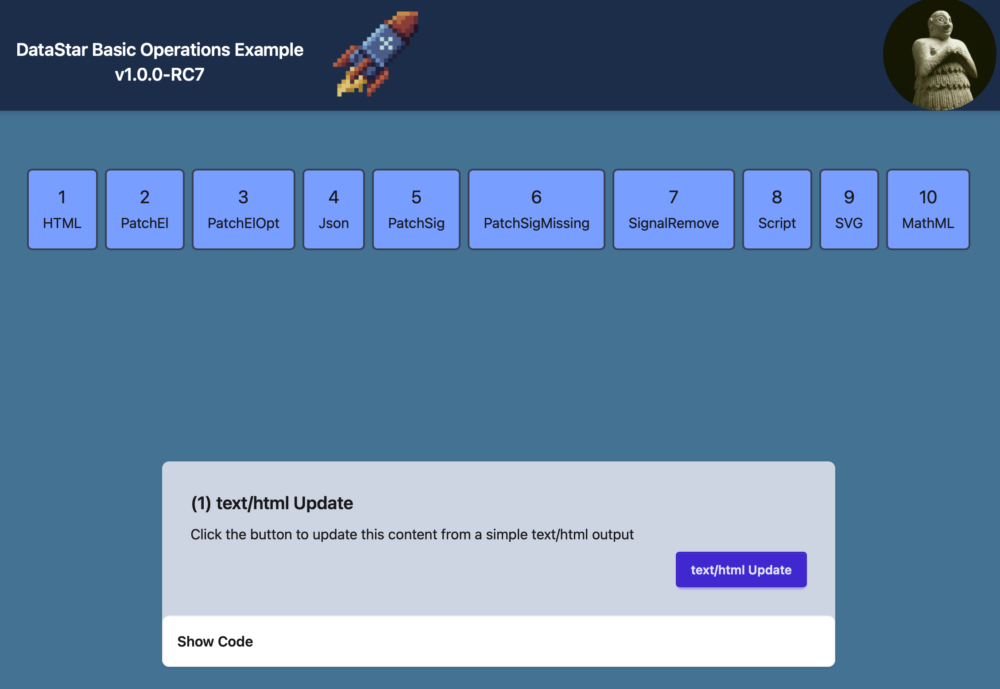

# datastar.zig - A Web Framework for Zig 0.16

**A Datastar-aware HTTP server for Zig 0.16. using Datastar v1.0.2**


Build realtime collaborative web apps where the backend pushes DOM patches, signal updates, and browser scripts to connected clients over a fast SSE pipe. Single binary, no JS bundler, no frontend framework.


- **Complete HTTP server in a single binary.** Radix-tree router, per-request arena, batched + sync SSE, hot reload during development, `*HTTPRequest` API that knows about Datastar. `zig build && ./your-app` and you're serving reactive HTML.
- **BYO IO backends, build-time selectable.** Default `std.Io.Threaded` (OS threads) for portability. `-Dio=zio` for stackful coroutines on N-executor scheduler. Same handler code, different concurrency model — see [Selecting the IO backend](#selecting-the-io-backend) and the [bench numbers](bench/README.md).
- **Bundled in-process pub/sub.** [`pubsub.zig`](https://github.com/zigster64/pubsub.zig) is wired in by default — enough to do CQRS in a single binary, with a clean off-ramp to NATS / Redis / Postgres LISTEN-NOTIFY when you outgrow it. See [Pub/Sub and CQRS](#pubsub-and-cqrs).
- **Full Datastar wire protocol.** Patches, signals, scripts. HTML / SVG / MathML namespaces, `view_transition`, `only_if_missing`, custom script attributes, event IDs, retry duration — everything from the [Datastar SDK ADR](https://github.com/starfederation/datastar/blob/develop/sdk/ADR.md). Passes the official validation suite.
- **SDK functions exposed too.** If you've already chosen a framework — [`http.zig`](https://github.com/karlseguin/http.zig), [`dusty`](https://github.com/lalinsky/dusty), `zap`, `jetzig`, `tokamak`, or stdlib — you can import just the four transformer functions and ignore the server. See [Using just the SDK](#using-just-the-sdk), or use the dedicated [`datastar-sdk.zig`](https://github.com/zigster64/datastar-sdk.zig) repo if you only want the SDK without the bundled server pulled in.

Related repos:

- [`datastar-sdk.zig`](https://github.com/zigster64/datastar-sdk.zig) — the SDK transformer functions on their own. Use this if you have a framework already and just want the Datastar wire format.
- [`datastar.http.zig`](https://github.com/zigster64/datastar.http.zig) — older stable Zig 0.15.2 version of this server.

## Zig Version

Requires Zig **0.16.0** or newer. Tracks the `0.16.0` release.

Breaking Change - sse.patchSignals no longer needs the 'json_options' field, so its simplified to `sse.patchSignals(object, options)`.

The JSON output is always set to minified now.

## Table of Contents

- [Quick Example](#quick-example)
- [Run the demos](#run-the-demos)
- [Installation](#installation)
- [The HTTP Server](#the-http-server)
- [Middleware](#middleware)
- [Selecting the IO backend](#selecting-the-io-backend)
- [Pub/Sub and CQRS](#pubsub-and-cqrs)
- [Performance](#performance)
- [Build, Run, Test](#build-run-test)
- [Using just the SDK](#using-just-the-sdk)
- [Snippets for Datastar Docs](#snippets)
- [More on Datastar](#more-on-datastar)

## Quick Example

```zig
const std = @import("std");
const datastar = @import("datastar");
const HTTPServer = datastar.HTTPServer;
const HTTPRequest = datastar.HTTPRequest;

pub fn main(init: std.process.Init) !void {
    var server = try HTTPServer.init(init, .{ .port = 8080 });
    defer server.deinit();

    server.router.get("/", index);
    server.router.get("/sse", sseHandler);

    try server.run();
}

fn index(http: *HTTPRequest) !void {
    return http.html(
        \\<!DOCTYPE html>
        \\<html>
        \\<head><script src="https://cdn.jsdelivr.net/npm/@starfederation/datastar" defer></script></head>
        \\<body data-on-load="@get('/sse')">
        \\  <div id="hello">(loading…)</div>
        \\</body>
        \\</html>
    );
}

fn sseHandler(http: *HTTPRequest) !void {
    var sse = try http.NewSSE();
    defer sse.close();
    try sse.patchElements("<div id='hello'>Hello from the server!</div>", .{});
    try sse.patchSignals(.{ .count = 42 }, .{});
}
```

A complete, working reactive Datastar app: `zig build && ./your-app`, visit `http://localhost:8080`.

## Run the demos

The fastest way to get a feel for what this library does is to run the bundled examples.

```bash
# Zig 0.16 or newer must be installed
git clone https://github.com/zigster64/datastar.zig
cd datastar.zig
zig build
./zig-out/bin/example_1
```

Then open `http://localhost:8081` in your browser. Crack open DevTools and watch the SSE stream in the Network tab — every interaction in the UI sends/receives small Datastar event blocks.



Each example demonstrates a different pattern:

| Binary             | Port  | What it shows                                                                 |
| ------------------ | ----- | ----------------------------------------------------------------------------- |
| `example_1`        | 8081  | Kitchen-sink walkthrough of every SDK function, with a live "show code" panel |
| `example_2`        | 8082  | Realtime cat auction — open multiple browser windows and watch bids sync     |
| `example_3`        | 8083  | WildCat auction with per-session preferences (cookies + pub/sub fan-out)      |
| `example_5`        | 8085  | Multi-player farming simulator with shared world state                        |
| `validation-test`  | 7331  | Backend for the official Datastar SDK conformance suite                       |

All examples support `-Dio=zio` for the coroutine backend — e.g. `zig build example_2 -Dio=zio`.

`TUTORIAL.md` has the longer walkthrough, including SVG/MathML morphing, advanced SSE patterns, and pub/sub recipes.

## Installation

```bash
zig fetch --save="datastar" "git+https://github.com/zigster64/datastar.zig"
```

Wire into `build.zig`:

```zig
const datastar = b.dependency("datastar", .{
    .target = target,
    .optimize = optimize,
});
exe.root_module.addImport("datastar", datastar.module("datastar"));
```

Import:

```zig
const datastar = @import("datastar");
```

## The HTTP Server

Handlers receive a `*HTTPRequest` with everything you typically need on a request:

```zig
fn handler(http: *HTTPRequest) !void {
    http.req                              // *std.http.Server.Request — full underlying request
    http.arena                            // per-request arena allocator
    http.io                               // std.Io — works with std.Io.Threaded or zio
    http.ctx                              // ?*anyopaque global context (set via server.useContext)
    http.params.get(name)                 // route path params
    http.params.getInt(T, name)
    http.method, http.path                // request line bits

    // Response helpers
    http.html(body) / htmlFmt(fmt, args)  // text/html
    http.json(value)                      // JSON-encoded
    http.css(body) / cssFmt(fmt, args)    // text/css
    http.js(body) / jsFmt(fmt, args)      // application/javascript
    http.sendFile(path, content_type)     // serve a file, mime-typed by extension

    // Read Datastar signals from the request
    http.readSignals(T)                   // T = your signals struct

    // Cookies, headers, query
    http.getCookie(name) / setCookie(...)
    http.query                            // raw query string
    http.extra_headers = &.{ ... };       // headers added on the response
}
```

For Datastar SSE responses, the `SSE` object wraps chunked encoding and the wire format:

```zig
fn sseHandler(http: *HTTPRequest) !void {
    var sse = try http.NewSSE();              // batched (single-shot response)
    defer sse.close();

    try sse.patchElements("<div id='x'>...</div>", .{});
    try sse.patchSignals(.{ .count = 42 }, .{});
    try sse.executeScriptFmt("alert('hi {s}')", .{name}, .{});
}
```

For long-lived persistent streams (typical CQRS query handler — see [Pub/Sub and CQRS](#pubsub-and-cqrs)):

```zig
fn liveHandler(http: *HTTPRequest) !void {
    var sse = try http.NewSSESync();          // each call flushed immediately
    defer sse.close();

    while (try mq.nextTimeout(.fromSeconds(30))) |event| switch (event) {
        .msg     => try sse.patchElements(render(), .{}),
        .timeout => try sse.keepalive(),
    }
}
```

Custom SSE buffer size via `NewSSEOpt`:

```zig
var sse = try http.NewSSEOpt(.{ .buffer_size = 32 * 1024, .sync = false });
```

Routing is a radix-tree, no allocation per match:

```zig
const r = server.router;
r.get("/", index);
r.get("/users/:id/:action", userAction);
r.post("/bid/:id", postBid);
r.patch("/items/:id", patchItem);
r.delete("/items/:id", deleteItem);
```

Server config (`Config` in `src/server.zig`):

```zig
.{
    .port               = 8080,
    .address            = null,        // null = listen on all addresses
    .io                 = null,        // override std.Io (see Selecting the IO backend)
    .allocator          = null,        // override gpa from std.process.Init
    .log                = .{},         // Log config (format, theme, levels)
    .watch              = false,       // hot reload — reboot on executable change (dev mode)
    .fd_limit           = null,        // .max, .limited(n), or null
    .read_buffer_size   = 4 * 1024,    // per-connection
    .write_buffer_size  = 4 * 1024,    // per-connection
}
```

**Hot reload during development.** Set `.watch = true`. The server watches its own executable on disk and, when you rebuild, exec's the new binary (via `std.process.replace`) while open browser tabs reconnect automatically. See `examples/01_basic.zig` for the complete pattern, including the client-side stale-tab detection.

The full walkthrough — batched vs sync writes, hot-reload setup, pub/sub patterns, header tricks, validation harness, benchmarking notes — lives in `TUTORIAL.md`.

## Middleware

Middleware functions run in **pipelines** — ordered lists of functions that execute before route handlers. Use them for auth, logging, rate limiting, request tracing — anything that should apply across routes.

A middleware is a function that takes `*HTTPRequest` and returns `!void`. It can inspect the request, set headers, attach data for downstream handlers, or short-circuit by setting `http.halted = true`:

```zig
fn authMiddleware(http: *HTTPRequest) !void {
    if (!isAuthenticated(http)) {
        http.respond("Unauthorized", .unauthorized) catch {};
        http.halted = true;
    }
}
```

### Pipelines

Group middleware functions into named pipelines with `server.pipeline()`, then assign them at three levels. Pipelines **accumulate** — a request picks up the global pipeline, then each matching route-group pipeline, then the route-level pipeline, all in order:

```zig
// Define pipelines
const publicPipe  = try server.pipeline(&.{ logMw, corsMw });
const userPipe    = try server.pipeline(&.{ sessionMw, authMw });
const adminPipe   = try server.pipeline(&.{ sessionMw, authMw, adminMw });
const auditPipe   = try server.pipeline(&.{ loggingMw });

// Global — runs on every request
server.usePipeline(publicPipe);

// Route group — all routes under /admin pick up adminPipe
try server.router.group("/admin", adminPipe);

// Per-route — extra pipeline on a specific endpoint
const r = server.router;
r.get("/", index);
r.getOpt("/admin/dashboard", dashboardHandler, .{ .pipeline = auditPipe });
```

A request to `/admin/dashboard` runs: `logMw → corsMw` (global) → `sessionMw → authMw → adminMw` (group) → `auditMw` (route) → handler.

All three levels are optional. `server.use(fn)` is a convenience wrapper that appends a single function to the global pipeline — use it for quick one-offs. `router.get` / `post` / etc. without `Opt` register routes with no extra pipeline. The pipeline runs **after** route matching (so `http.params` is populated) but **before** the route handler. If middleware sets `http.halted = true`, the remaining middleware and the handler are skipped.

### Per-request assigns

Middleware can attach typed data to the request via `http.assign()`. Downstream middleware and handlers retrieve it with `http.assigned()`:

```zig
// Middleware: attach request metadata
fn requestInfoMiddleware(http: *HTTPRequest) !void {
    const now = std.Io.Clock.real.now(http.io);
    _ = try http.assign(usize, "request.id", nextId());
    _ = try http.assign(std.Io.Timestamp, "request.started", now);
}

// Handler: read the assigned data
fn myHandler(http: *HTTPRequest) !void {
    const id: usize = http.assigned(usize, "request.id") orelse 0;
    const started: std.Io.Timestamp = http.assigned(std.Io.Timestamp, "request.started") orelse .zero;
    // ...
}
```

The store is a lazy-initialized `std.ArrayList` backed by the per-request arena — no hard capacity limit. Keys are strings (`"auth.user"`, `"tracer.span_id"`) — use namespaced keys to avoid collisions between independent middleware. `assigned()` returns `?T` — use `orelse` for a clean default. The type parameter must match what was used in `assign()` — the cast is unchecked.

### Error handling

Errors returned by middleware are caught by the dispatch loop and result in a 500 response. There is no separate error middleware chain — catch errors in your middleware if you need custom recovery:

```zig
fn robustMiddleware(http: *HTTPRequest) !void {
    doRiskyThing(http) catch |err| {
        std.log.warn("middleware recovered from {}", .{err});
        // continue the pipeline
    };
}
```

### Logging

Request logging runs automatically after every handler via `log.logRequest()`. Configured through the `Log` struct in server config — level (none/path/payload/signals/all), format (terminal/json), theme (classic/newwave/monochrom), and timing thresholds. The logger is called from dispatch, not middleware, so elapsed time is measured correctly. To disable logging, set `.level = .none` in the server config.

See `examples/01_basic.zig` tab 12 for a complete working middleware demo.

## Selecting the IO backend

The server is built on `std.Io` and is backend-interchangeable at build time:

```bash
zig build example_1              # default: -Dio=std  (stdlib Io.Threaded)
zig build example_1 -Dio=zio     # use lalinsky/zio (stackful coroutines)
```

| Flag        | Backend                                                       | Notes                                                                                              |
| ----------- | ------------------------------------------------------------- | -------------------------------------------------------------------------------------------------- |
| `-Dio=std`  | `std.Io.Threaded`                                             | Default. Handlers run on a growing pool of OS threads. No extra deps in the binary.                |
| `-Dio=zio`  | [`zio.Runtime`](https://github.com/lalinsky/zio)              | Stackful coroutines on an N-executor scheduler. `.auto` resolves to one executor per CPU core.     |

On startup each example logs which backend is active:

```
info: 🧵 IO backend: std Io.Threaded
info: 🌀 IO backend: zio (stackful coroutines)
```

Wiring zio into your own `main` is a few lines — kept behind a comptime branch so `-Dio=std` builds don't depend on `zio` at all:

```zig
const use_zio = options.io_mode == .zio;
const zio = if (use_zio) @import("zio") else void;

pub fn main(init: std.process.Init) !void {
    const rt = if (use_zio) try zio.Runtime.init(init.gpa, .{ .executors = .auto }) else {};
    defer if (use_zio) rt.deinit();
    const io: std.Io = if (use_zio) rt.io() else init.io;

    var server = try datastar.HTTPServer.init(init, .{ .port = 8080, .io = io });
    defer server.deinit();
    // ...
    try server.run();
}
```

Every example in `examples/*.zig` and `tests/validation.zig` is wired up this way — they all run under either backend.

## Pub/Sub and CQRS

Reactive multi-player Datastar apps almost always end up doing CQRS in miniature: a `POST /bid` command mutates state, and every connected SSE stream that cares about that state needs to be told to re-render. That requires an in-process message bus to fan out from command handlers to all the long-lived SSE subscribers.

The SDK bundles [`pubsub.zig`](https://github.com/zigster64/pubsub.zig) for this — a small in-process broker built specifically for these Datastar SSE runners. It's wired in by default, so there's nothing extra to add to `build.zig`:

```zig
const datastar = @import("datastar");
const pubsub = datastar.pubsub;   // re-exported for convenience
```

A typical CQRS loop — query side subscribes and streams updates, command side publishes after mutating state:

```zig
// Query side: long-lived SSE that re-renders whenever `cats` is published
fn catsList(app: *App, http: *HTTPRequest) !void {
    var sse = try http.NewSSESync();
    defer sse.close();
    try pushCatList(app, &sse);            // initial render

    var mq = try app.pubsub.connect();
    defer mq.deinit();
    try mq.subscribe(.cats);

    while (try mq.nextTimeout(.fromSeconds(30))) |event| switch (event) {
        .msg     => try pushCatList(app, &sse),
        .timeout => try sse.keepalive(),
    }
}

// Command side: mutate, then publish
fn postBid(app: *App, http: *HTTPRequest) !void {
    // ... validate + apply the bid ...
    try app.pubsub.publish(.{ .cats = {} }, .all);
}
```

You don't have to use the bundled broker. It's bundled because it's the shortest path from "single binary" to "working multi-player demo" — every example in this repo that needs fan-out uses it (`example_2`, `example_3`, `example_5`). When you outgrow single-process — multiple app instances, durability, cross-language consumers — swap it for **NATS**, **Redis pub/sub**, **Postgres LISTEN/NOTIFY**, or any other broker. The handler shape stays the same: subscribe, loop, render on each message; publish from the command handler. Only the `connect` / `subscribe` / `publish` calls change.

See `examples/02_cats.zig` for a complete worked example, and the *Publish and Subscribe* section of `TUTORIAL.md` for the longer walkthrough.

## Performance

100 KB Datastar SSE event-stream benchmark, `wrk -t12 -c400 -d10s`, ReleaseFast, Apple Silicon:

| Backend              | Throughput     | Avg latency  | Latency stddev  | Max latency    |
| -------------------- | -------------- | ------------ | --------------- | -------------- |
| `Io.Threaded` (Fast) | 24,750 req/s   | 17.08 ms     | 16.49 ms        | 241 ms         |
| **zio (.auto, Fast)** | **25,248 req/s** | **15.18 ms** | **4.30 ms**     | **58 ms**      |

zio matches `Io.Threaded` on throughput and gives **~4× tighter tail latency** under load — same workload, the only difference is how the server's IO suspends underneath. For a reactive UI, what matters isn't the avg — it's that no one in a hundred users gets a 250 ms hiccup.

See [`bench/README.md`](bench/README.md) for the full comparison: Debug builds, plain HTML baseline, and historical / cross-language reference numbers.

## Build, Run, Test

```bash
zig build                       # build everything into zig-out/bin
zig build test                  # run unit tests
zig build check                 # type-check everything (for ZLS)
zig build example_1             # run example_1 directly via the build system
zig build example_1 -Dio=zio    # same, with zio coroutines
zig build http.zig              # build the http.zig SDK adapter (opt-in)
zig build dusty                 # build the dusty SDK adapter (opt-in)
```

See [Run the demos](#run-the-demos) for the list of example binaries and what each one shows.

## Using just the SDK

If you've already chosen an HTTP framework — `http.zig`, `dusty`, `zap`, `jetzig`, `tokamak`, stdlib HTTP, whatever — you can use just the four SDK transformer functions and skip the bundled server entirely.

> **For SDK-only use, prefer [`datastar-sdk.zig`](https://github.com/zigster64/datastar-sdk.zig)** — same transformer functions packaged as a standalone module, without dragging in the bundled HTTP server or the pubsub dependency. This section is a quick reference; the dedicated repo is what you want to depend on for production SDK-only use.

Each transformer returns a complete `event: ...\ndata: ...\n\n` SSE block — concatenate as many as you want and write them as the response body with `Content-Type: text/event-stream`:

```zig
const datastar = @import("datastar");

// Inside any framework's SSE handler, with an arena and a `res` from your framework:

const a = try datastar.patchElements(arena, "<div id='hello'>Hi</div>", .{});
const b = try datastar.patchSignals(arena, .{ .foo = 42, .bar = "Datastar Rocks" }, .{});
const c = try datastar.executeScriptFmt(arena, "alert('hello {s}')", .{name}, .{});

res.header("Content-Type", "text/event-stream");
res.body = try std.mem.concat(arena, u8, &.{ a, b, c });

// And to read Datastar signals on the way in:
const Signals = struct { name: []const u8, count: u32 };
const signals = try datastar.readSignals(Signals, arena, req);
```

The full SDK surface:

```zig
// Read Datastar signals from a request — GET pulls them from the
// `datastar` query param, POST/PUT/PATCH/DELETE from the body.
datastar.readSignals(comptime T: type, arena: Allocator, req: *std.http.Server.Request) !T

// Patch DOM elements
datastar.patchElements(arena, html, opts) ![]const u8
datastar.patchElementsFmt(arena, comptime fmt, args, opts) ![]const u8

// Patch signals (any JSON-serializable value)
datastar.patchSignals(arena, value, opts) ![]const u8

// Execute a script on the client (wraps the script in a <script> tag and patches it into body)
datastar.executeScript(arena, script, opts) ![]const u8
datastar.executeScriptFmt(arena, comptime fmt, args, opts) ![]const u8

// Helper — re-exported for framework adapters
datastar.urlDecode(allocator, input) ![]u8
```

Options:

```zig
PatchElementsOptions { mode, selector, view_transition, event_id, retry_duration, namespace }
PatchSignalsOptions  { only_if_missing, event_id, retry_duration }
ExecuteScriptOptions { auto_remove, attributes, event_id, retry_duration }

PatchMode = .inner | .outer | .replace | .prepend | .append | .before | .after | .remove
NameSpace = .html | .svg | .mathml
```

`.{}` is almost always the right value for the options argument. See `src/datastar.zig` for the full option fields and defaults.

### Reference adapters

The kitchen-sink `example_1` is also wired up to two third-party HTTP frameworks using only the generic transformer functions. They double as the canonical reference for plugging the SDK into any framework:

| Target               | Output binary       | Framework                                                       | Source                          |
| -------------------- | ------------------- | --------------------------------------------------------------- | ------------------------------- |
| `zig build http.zig` | `example_1_httpz`   | [`karlseguin/http.zig`](https://github.com/karlseguin/http.zig) | `examples/01_basic_httpz.zig`   |
| `zig build dusty`    | `example_1_dusty`   | [`lalinsky/dusty`](https://github.com/lalinsky/dusty)           | `examples/01_basic_dusty.zig`   |

Both run on the same `:8081` port and serve the same UI as `example_1` — the navbar shows which web server is driving the page.

### `readSignals` in frameworks that hide the underlying request

`datastar.readSignals` currently expects a `*std.http.Server.Request`. If your framework wraps the request, parse the signals JSON yourself — they arrive as `?datastar=<url-encoded-json>` on a GET, or as the raw JSON body on POST/PUT/PATCH/DELETE:

```zig
const Signals = struct { foo: u32, bar: []const u8 };

fn readSignalsAnyFramework(
    arena: Allocator,
    method: std.http.Method,
    query_string: ?[]const u8, // everything after the '?' in the URL, or null
    body: ?[]const u8,         // request body bytes, or null
) !Signals {
    const json = switch (method) {
        .GET => blk: {
            const qs = query_string orelse return error.MissingDatastarKey;
            var it = std.mem.tokenizeScalar(u8, qs, '&');
            while (it.next()) |pair| {
                if (std.mem.startsWith(u8, pair, "datastar=")) {
                    break :blk try datastar.urlDecode(arena, pair["datastar=".len..]);
                }
            }
            return error.MissingDatastarKey;
        },
        else => body orelse return error.MissingBody,
    };

    return std.json.parseFromSliceLeaky(
        Signals,
        arena,
        json,
        .{ .ignore_unknown_fields = true },
    );
}
```

## Snippets

For backend code snippets for the Datastar docs, see [SNIPPETS.md](SNIPPETS.md)

## More on Datastar

- [data-star.dev](https://data-star.dev) — official site and reference
- [Datastar SDK ADR](https://github.com/starfederation/datastar/blob/develop/sdk/ADR.md)
- [Datastar Discord](https://discord.gg/YfFn7pKx)
- [Zig Discord](https://discord.gg/Chk5WKM5)

## Contributing

PRs welcome. Please open an issue first to discuss non-trivial changes, and reference the issue in the PR title.
